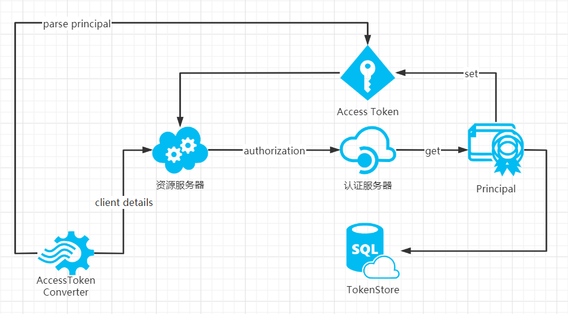

# 使用转换器从token中获取对应的client信息

## 原请求

``` base
http://124.71.185.137:8077/oauth/token?client_id=cli&client_secret=sec&scopes=app&grant_type=client_credentials
```

> Basic Auth --- Username: cli & Password: sec

``` bash
http://124.71.185.137:8077/oauth/token?grant_type=client_credentials&scopes=app
```

## 需求

当我们已经知道如何通过token对资源服务器进行访问时，会陷入一个疑惑

我们怎么样才能知道使用这个token的访问者到底是谁？

token的内部是不是还潜藏着我们需要的信息？

## 概述

从这之前我们知道每个不同的client_id其授权得到的token都是不同的

也就是说这个问题的前提是必须绑定每个用户使用的client_id都不一样

而从这之后，我们并不知道的就是转接器的存在与用法

我们完全可以通过DefaultAccessTokenConverter来解决这个问题

## 原理参考图



## 源码

- DefaultAccessTokenConverter

``` java
 /**
  * 转换器中代表用户的令牌中的部分数据。
  *
  * @param userTokenConverter要设置的userTokenConverter
  */
  public void setUserTokenConverter(UserAuthenticationConverter userTokenConverter) {
     this.userTokenConverter = userTokenConverter;
  }
```

- DefaultUserAuthenticationConverter

``` java
 /**
  * 从传入映射中提取{@link Authentication}时使用的可选{@link UserDetailsService}。
  *
  * @param userDetailsService要设置的userDetailsService
  */
  public void setUserDetailsService(UserDetailsService userDetailsService) {
     this.userDetailsService = userDetailsService;
  }
```

- getContext()、getAuthentication()、getPrincipal()

``` java
 /**
  * 获取当前的<code> SecurityContext </ code>。
  *
  * @返回安全上下文（从不<null> null </ code>）
  */
  public static SecurityContext getContext() {
     return strategy.getContext();
  }
  
 /**
  * 获取当前已认证的主体或认证请求令牌。
  *
  * @如果没有身份验证，则返回<code> Authentication </ code>或<code> null </ code>
  * 信息可用
  */
  Authentication getAuthentication();
  
  /**
   * 身份验证的主体的身份。在认证的情况下
   * 使用用户名和密码进行请求，这将是用户名。来电者是
   * 预期将填充身份验证请求的主体。
   * <p>
   * <tt> AuthenticationManager </ tt>实现通常会返回一个
   * <tt> Authentication </ tt>包含更丰富的信息作为供主体使用的主体
   * 应用程序。许多身份验证提供程序将创建一个
   * {@code UserDetails}对象作为主体。
   *
   * @返回被验证的<code> Principal </ code>或已验证的<code> Principal </ code>
   * 身份验证后的主体。
   */
   Object getPrincipal();
```

## 核心代码

资源服务器的配置类

``` java
@Bean
public DefaultAccessTokenConverter defaultAccessTokenConverter(){
  DefaultAccessTokenConverter converter = new DefaultAccessTokenConverter();
  DefaultUserAuthenticationConverter userConverter = new DefaultUserAuthenticationConverter();
  userConverter.setUserDetailsService(new MyUserDetailsService());
  converter.setUserTokenConverter(userConverter);
  return converter;
}

@Override
public void configure(AuthorizationServerEndpointsConfigurer endpoints) {
  endpoints.tokenStore(tokenStore())
      .authenticationManager(new OAuth2AuthenticationManager())
      .allowedTokenEndpointRequestMethods(HttpMethod.GET, HttpMethod.GET)
      .userDetailsService(new MyUserDetailsService())
      .accessTokenConverter(defaultAccessTokenConverter());//依照token获取当前登录用户的信息
}
```

获取client信息的方法

``` java
SecurityContextHolder.getContext().getAuthentication().getPrincipal()
```
